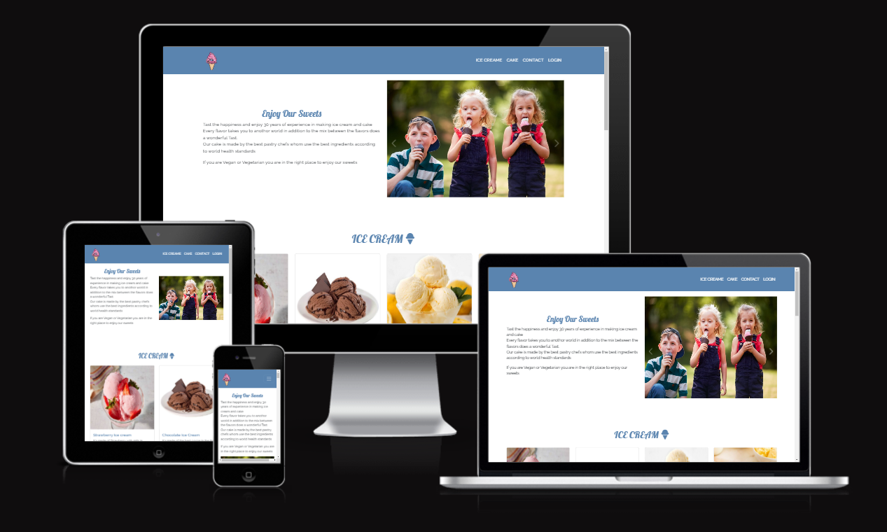
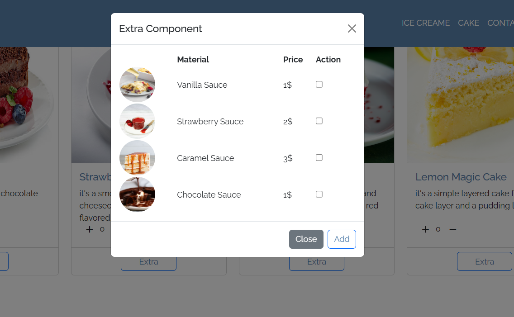

# icecreame-shop
---
Online Shop to buy ice cream and cake, which enable you either buy prepared cake or icecream and choose the suace on them or to buy icecream by weight.

# Features
* Home Page
    * In order to return to home page customer can press on Logo            

* Add ice cream
    * Customer can choose either from a prepared ice cream by pressing on plus button on the specific ice cream

* Add Sauce
    * If the customer wants to add sauce, customer presses on extra button a modal will be shown as below

* Add Ice cream by weight
    * Customer can put ice cream ball in the can as the image below

* Add cake
    * Customer can add the cake by pressing on plus button              

* Log in page
    *  Customer can log in using email and password                 

* Sign up
    *  In order sign up Customer have to register with personal data city - street zip code..., these data would be used for the delivery purpose

# Testing
---
### Validator Testing
---
* HTML
    * No errors were returned when passing through the official [W3C validator](https://validator.w3.org/#validate_by_input)
* CSS
    * No errors were found when passing through the official [(Jigsaw) validator](https://jigsaw.w3.org/css-validator/#validate_by_input)
* JavaScript
    * one error were found when passing through the official [Jshint validator](https://jshint.com/)
        * There are 6 functions in this file.
        * Function with the largest signature take 3 arguments, while the median is 1.
        * Largest function has 17 statements in it, while the median is 3.5.
        * The most complex function has a cyclomatic complexity value of 6 while the median is 1.5.

# Credits 
---
### Media
* Images were taken from Pexel.com - pixabay.com - https://www.freepik.com/
* Favicon is generated using https://realfavicongenerator.net/
* For icons i used fontawesome library

### Bugs
---
* no bugs were found

# Deployment
---
* The site was deployed to GitHub pages. The steps to deploy are as follows:
    * In the GitHub repository, navigate to the Settings tab
    * From the source section drop-down menu, select the Master or Main Branch
    * Once the master branch has been selected, the page will be automatically refreshed with a detailed ribbon display to indicate the successful deployment.
    * The live link can be found here - [live production](https://mohanadpro.github.io/icecreame-shop/)

# To clone the project :
* You have to clone the project using git clone https://mohanadpro.github.io/icecreame-shop/

# Used technologies:  
### Programming languages 
---
*  HTML - CSS - Bootstrap
### Tools
---
* VSCode was used as the main tool to write and edit code.
* Git was used for the version control of the website.
* GitHub was used to host the code of the website.

